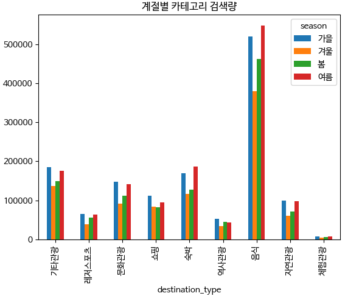
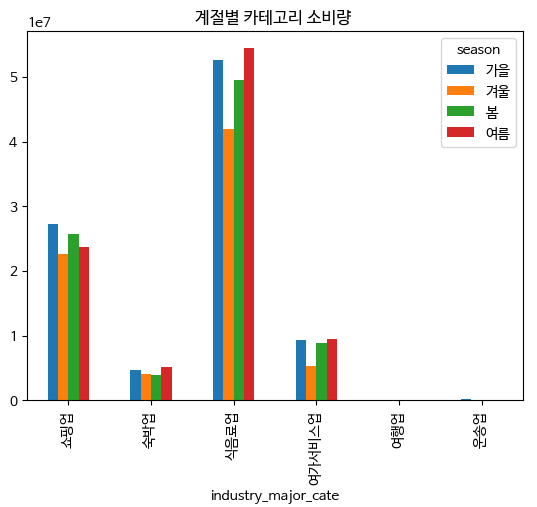
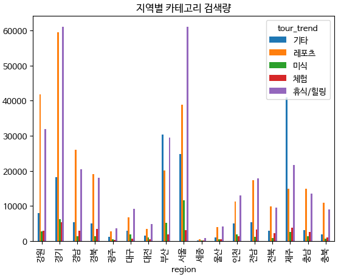
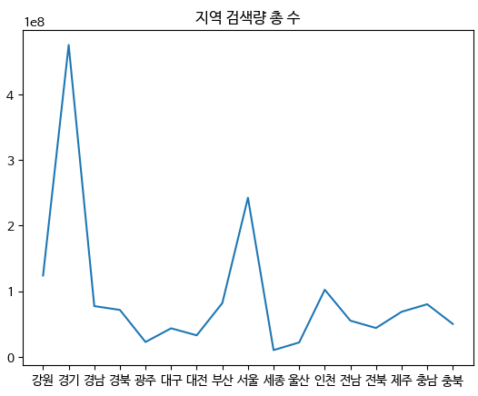
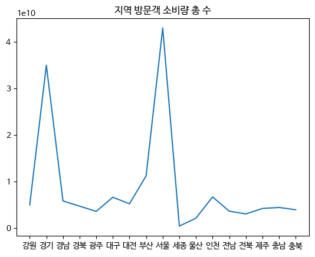
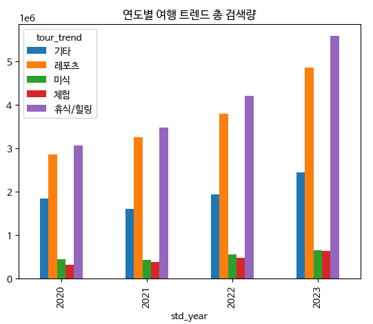

# 📈 여행 데이터 분석

## 📚 [DDA](./DDA.ipynb)
<details open> 
  <summary>사용 데이터</summary>

- [Keyword_search_by_date](./csv/Keyword_search_by_date.csv)
: 월별 관광 테마 검색량

|*|Variable|Definition|Key|분석가 의견|
|--|--|--|--|--|
|1|destination_type|관광 테마명|숙박, 음식기타관광, 쇼핑, 문화관광, 역사관광, 자연관광, 체험관광, 레저스포츠|범주형|
|2|destination_search|검색량||수치형|
|3|region|지역명|강원, 경기, 경남, 경북, 광주, 대구, 대전, 부산, 서울, 세종, 울산, 인천, 전남, 전북, 제주, 충남, 충북|범주형|
|4|std_year|년도|2020, 2021, 2022, 2023|범주형(순서형)|
|5|std_month|월|1,  2,  3,  4,  5,  6,  7,  8,  9, 10, 11, 12|범주형(순서형), 계절별로 범주를 나누어 사용 가능|
|6|std_year_month|년도+월||범주형(순서형)|


- [Number_of_visitors_date](./csv/Number_of_visitors_date.csv)
: 업종 카테고리별 월 소비량

|*|Variable|Definition|Key|분석가 의견|
|--|--|--|--|--|
|1|industry_major_cate|카테고리명|전체, 운송업, 여행업, 숙박업, 식음료업, 여가서비스업, 쇼핑업|범주형|
|2|std_year_month|년도+월||범주형(순서형)|
|3|std_year|년도|2020, 2021, 2022, 2023|범주형(순서형)|
|4|std_month|월|1,  2,  3,  4,  5,  6,  7,  8,  9, 10, 11, 12|범주형(순서형)|
|5|consumption_amount|소비량||수치형|
|6|region|지역명|강원, 경기, 경남, 경북, 광주, 대구, 대전, 부산, 서울, 세종, 울산, 인천, 전남, 전북, 제주, 충남, 충북|범주형|


- [Trend_search_date](./csv/Trend_search_date.csv)
: 월별 여행 트렌드 검색량 

|*|Variable|Definition|Key|분석가 의견|
|--|--|--|--|--|
|1|region|지역명|강원, 경기, 경남, 경북, 광주, 대구, 대전, 부산, 서울, 세종, 울산, 인천, 전남, 전북, 제주, 충남, 충북|범주형|
|2|std_year_month|년도+월||범주형(순서형)|
|3|std_year|년도|2020, 2021, 2022, 2023|범주형(순서형)|
|4|std_month|월|1,  2,  3,  4,  5,  6,  7,  8,  9, 10, 11, 12|범주형(순서형)|
|5|tour_trend|트렌드명|레포츠, 휴식/힐링, 기타, 미식, 체험|범주형|
|6|num_mention|검색량||수치형|


- [Trend_search_date](./csv/data_tour_NLP_train.csv)
: 블로그 제목

|*|Variable|Definition|Key|분석가 의견|
|--|--|--|--|--|
|1|concept||0, 1, 2, 3, 4, 5, 6||
|2|season||0, 1, 2, 3, 4, -||
|3|review_text|블로그 제목|||
|4|지역|지역|||
|5|review_text_clean|자연어처리 된 블로그 제목|||
</details>


## 📚 [EDA](./EDA.ipynb)
<details open> 
  <summary>분석 방향성</summary>

```
- 가설: 지역별 키워드 검색량과 관광지 소비량(방문자 수) 간에 상관 관계가 있을 것이다.
- 설명: 지역별로 특정 키워드의 검색량이 높을수록 해당 지역을 방문하는 소비량이 증가할 것으로 예상됨. 어떤 키워드 검색이 소비량에 영향을 미치는지 이해하여 마케팅 전략에 반영할 수 있음.
- 각 검색량/소비량 데이터가 정규분포를 따르지 않으므로 평균값의 비교는 적절하지 않다고 판단. 중앙값 이용
- 중앙값은 데이터를 크기별로 정렬했을 때 중간에 위치한 값으로, 이상치나 왜곡된 데이터에 큰 영향을 받지 않고 전체적인 데이터의 중심을 나타냄.
```

----
### ✏️ 제안 1 : 계절별 카테고리 검색량/소비량 평균 비교
```
- 문제 정의 : 카테고리의 계절별 검색 추이를 시각화하여 계절적 패턴을 확인함.
- 배경 : 특정 키워드의 검색량이 계절에 따라 변화할 수 있음. 예를 들어 여름에는 레저스포츠 관련 키워드의 검색량이 증가할 것으로 예상됨. 이를 통해 계절적 검색 패턴을 이해할 수 있음.
```


```
계절 전체적으로 겨울의 검색량이 적고, 가을의 검색량이 많다.
--> 가을에 여행을 많이 가고 겨울에는 비교적 적게 간다.
카테고리 중 음식(식음료업)의 검색량이 가장 많고, 소비량도 가장 많다.
레저스포츠의 경우 전체 계절 중 여름에 검색량이 많을 것으로 예상했으나 가을과 비슷함.
숙박과 음식의 경우 가을보다 여름의 검색량이 더 많다.
체험관광과 역사관광의 경우 선호도가 떨어진다.
쇼핑업은 가을에, 식음료업은 여름에 선호도가 높다.
- 전략 제안 : 사용자가 지역 검색 시, 지역 맛집 추천을 우선으로 한다면 어떨까
```
-----

### ✏️ 제안 2 : 지역별 여행 트렌드 선호도 분석
```
- 문제 정의 : 지역별 카테고리 방문자 선호도 비교: 트렌드 검색량 데이터 이용
- 배경 : 해당 트렌드(카테고리)에 대한 검색량을 비교하여 선호도를 분석할 수 있음.
```

```
광주, 대구, 대전, 세종, 울산 의 경우 검색량이 적음 -> 여행 지역으로서의 선호도가 떨어짐.
전체적으로 레포츠와 휴식/힐링의 검색량이 높게 나타남.
서울, 경기, 강원, 부산, 제주 지역의 선호도가 높음
부산과 제주는 기타 카테고리의 선호도가 가장 높게 나타남.
서울, 경기 지역에서 휴식/힐링 카테고리가 높게 나타나는 점이 의외임. -> 말 그대로 휴식/힐링이 아니라 숙소 검색까지 합친 것이라면 이해됨
```




```
- 지역마다의 검색량과 방문자 선호도 분석: 데이터셋에 있는 지역 정보를 기반으로 지역별 검색량과 방문자 수를 비교하여 지역마다의 선호도와 관심사를 파악할 수 있습니다.

경기 지역의 검색량이 가장 높은 반면 지역 소비량은 서울이 가장 높다.
선호도가 가장 낮은 지역 : 세종
```

----

### ✏️ 제안 3 : 연도별 여행 트렌드 선호도 분석
```
- 문제 정의: 연도별로 소비자의 행동 변화를 파악하고 향후 전략에 반영할 수 있는 인사이트를 도출함.
- 배경: 시간이 지남에 따라 사용자의 관심사와 행동이 변화할 수 있음. 년도 데이터를 활용하여 어떤 여행 카테고리나 활동이 특정 시기에 더 인기가 있는지 예측할 수 있음.
```

```
해가 지날수록 여행에 대한 관심이 높아지고 있음.
2024년엔 더 높아질 것으로 예상 됨.
2020, 2021년엔 레포츠와 휴식/힐링 카테고리의 검색량이 비슷했으나 2022년부터 격차가 벌어짐.
--> "호캉스"라는 키워드가 떠오르기 시작한 시기라서 검색량이 증가한 것인지 추가 분석을 해볼 수 있겠음.
```

</details>


## 📚 [CDA](./CDA.ipynb)
<details open> 
  <summary>분석 방향성</summary>

```
- 가설 1 : 키워드 검색량(연속)과 관광지 소비랑(연속) 간에 상관 관계가 있을 것이다.
- 귀무 가설 : 키워드 검색량과 관광지 소비랑 간에 상관 관계가 없다.
- 대립 가설 : 키워드 검색량과 관광지 소비랑 간에 상관 관계가 있다

[분석 결과]
SignificanceResult(statistic=0.8631067847857828, pvalue=0.0)
- 통계 결론 : pvalue가 0.05보다 작으므로 -> 귀무가설 기각
- 사실 결론 : 키워드 검색량과 관광지 방문객수 간에 상관 관계가 있다.
```
```
- 가설 2 : 계절(범주)에 따라 카테고리(범주)별 소비량(연속)에 차이가 있을 것이다.
- 귀무 가설 : 계절에 따라 카테고리별 소비량에 차이가 없다.
- 대립 가설 : 계절에 따라 카테고리별 소비량에 차이가 있다.

[분석 결과]
KruskalResult(statistic=4252.465677366361, pvalue=0.0)
- 통계 결론 : pvalue가 0.05보다 작으므로 -> 귀무가설 기각
- 사실 결론 : 계절에 따라 카테고리별 소비량에 차이가 있다
```
```
- 가설 3 : 지역에 따라 여행 트렌드 선호도의 차이가 있을 것이다.
- 귀무 가설 : 지역에 따라 여행 트렌드 선호도의 차이가 없다.
- 대립 가설 : 지역에 따라 여행 트렌드 선호도의 차이가 있다.

[분석 결과]
KruskalResult(statistic=4078.9999999999995, pvalue=0.0)
- 통계 결론 : pvalue가 0.05보다 작으므로 -> 귀무가설 기각
- 사실 결론 : 지역에 따라 여행 트렌드 선호도의 차이가 있다.
```
</details>


## 📚 [MLs](./MLs.ipynb)
<details open> 
  <summary>MLs</summary>

```
- 목표변수(target) : consumption_amount 소비량
- 설명변수(features) : industry_major_cate 카테고리, region 지역, std_year 년도, std_month 월
- 미래의 소비량을 예측
```
```
[범주형 변수 인코딩]
- Label Encoding
각 범주형 값에 연속적인 정수를 부여하는 방법
연도나 월 같이 순서 또는 크기가 있고, 숫자 간의 관계를 고려해야 할 때 적합
std_year 년도, std_month 월

- Feature Importance Encoding
각 범주형 변수가 목표 변수에 미치는 영향력을 고려하여 인코딩하는 방법
industry_major_cate 카테고리, region 지역
```
```
[모델 학습]
선형 회귀(Linear Regression)
✔ 결정 트리 회귀 (Decision Tree Regression)
랜덤 포레스트 회귀 (Random Forest Regression)
서포트 벡터 머신 회귀 (Support Vector Machine Regression)
그라디언트 부스팅 회귀 (Gradient Boosting Regression)

[모델 평가]
- MSE - 평균 제곱 오차 / 모델이 예측한 값과 실제 값 사이의 차이를 제곱한 후 평균을 구한 값
- Mean Squared Error (MSE): 495008521006880.8

- MAE - 평균 절대 오차 / 모델이 예측한 값과 실제 값 사이의 절대값 차이를 평균화한 값
- Mean Absolute Error (MAE): 5733668.298507462

- 0에 가까울 수록 모델의 예측이 정확함
- 결과 : 모델의 예측이 매우 부정확함. 특정한 상황을 고려할 필요가 있으며, 추가적인 분석과 확인을 통해 모델의 성능을 향상시킬 수 있음.
```
</details>


## 📚 [NLPs](./NLPs.ipynb)
<details open> 
  <summary>NLPs</summary>

### ✏️ 블로그 제목 데이터를 이용, 지역별 워드클라우드 생성

```
- 지역별 워드클라우드 생성을 통해 지역별 여행 트렌드, 인기있는 여행지, 특정 지역에서 강조되는 여행 테마 등을 알 수 있습니다.

- 블로그 제목 데이터량 top 3 : 제주, 대전, 울산
- 검색량 top 3 : 경기, 서울, 강원
```
#### 제주

- 서귀포, 여행, 맛집, 자연, 공원, 명소, 코스
#### 대전

- 공원, 카페, 맛집, 마을, 산책 풍경, 명소
#### 울산

- 공원, 산책, 아이, 놀이터, 도서관, 문화, 장생포
#### 경기

- 경기, 공원, 카페, 코스, 근교, 명소, 체험
#### 서울

- 여행, 문화, 명소, 공원, 코스, 전시, 벚꽃, 축제
#### 강원

- 강원, 여행, 축제, 자연, 추천, 겨울, 숲, 바다


---

### ✏️ LDA 이용 토픽 분석

```
- 지역별 주요 토픽 식별을 통해 특정 지역의 관심사나 주요 활동에 대한 통찰을 얻을 수 있습니다.
- 지역 간 토픽 비교를 통해 지역 간의 특징이나 차이점을 파악하고, 각 지역의 유니크한 특성을 이해할 수 있습니다.
```
#### 제주

|Topic 0|Topic 1|Topic 2|Topic 3|Topic 4|
|--|--|--|--|--|
|서귀포, 관광지, 여행, 맛집, 아이, 풍경, 매력, 실내, 서쪽, 제주|숲길, 박물관, 해수욕장, 산책, 공원, 공항, 서귀포, 감귤, 우주, 근처|여행, 맛집, 사진, 일몰, 명소, 가을, 돼지, 축제, 코스, 투어|여행, 코스, 추천, 명소, 우도, 여행지, 겨울, 해안, 여름, 드라이브|자연, 마을, 문화, 휴양림, 역사, 공원, 유적지, 방문, 체험, 세계|

#### 대전

|Topic 0|Topic 1|Topic 2|Topic 3|Topic 4|
|--|--|--|--|--|
|연두, 국공립, 종주, 배롱나무, 전광석화, 버스, 장면, 영산홍, 환경|이곳, 삼림욕, 암석원, 구간, 구민, 연두, 감지, 초여름, 꿀맛|종주, 배롱나무, 아메리칸, 트리, 보석, 가을밤, 모집|종주, 보석, 체험, 주말, 경험, 조정, 무료|포장, 발대식, 브리지, 주목, 구간, 코스, 서원, 완공|

#### 울산

|Topic 0|Topic 1|Topic 2|Topic 3|Topic 4|
|--|--|--|--|--|
|정서, 나기, 휴장, 서예, 하화, 선거전, 포토, 제호|치매, 신체, 작소, 기업, 기차, 정서, 개장, 대동|휴장, 서예, 일자리, 소금, 갈치, 뷔페|휴장, 소금, 히든, 공예, 회화나무, 빙상|새별, 숲길, 기업, 애서, 지역|

#### 경기

|Topic 0|Topic 1|Topic 2|Topic 3|Topic 4|
|--|--|--|--|--|
|여행, 가을, 역사, 명소, 경기, 단풍, 우리, 도시, 근교, 공원|코스, 여행, 근교, 경기, 공원, 아이, 드라이브, 남양주, 문화, 가평|경기, 기회, 바다, 파주, 교육, 미래, 현장, 당신, 출범식, 체험|운동, 여행, 카페, 공원, 박물관, 평화, 도서관, 아이, 어린이, 갈대|경기, 카드, 연꽃, 출범, 뉴스, 마을, 세계, 여행, 스팟, 문화|

#### 서울

|Topic 0|Topic 1|Topic 2|Topic 3|Topic 4|
|--|--|--|--|--|
|대중, 운영, 위주|지원금, 담장, 대공원, 건축, 만남|운영, 인기, 감탄, 안심|인기, 구로, 양재|오픈, 전시, 담장, 최고|

#### 강원

|Topic 0|Topic 1|Topic 2|Topic 3|Topic 4|
|--|--|--|--|--|
|애물단지, 가락, 앨범, 명장, 거리, 대게, 영랑, 도심, 국토, 골계|축물, 애물단지, 국토, 거리, 골계, 시립, 떡메, 나무, 무한, 가을|거리, 기대, 반려, 타워, 광지, 민물, 한잔, 대리, 청간, 진가|영원, 애물단지, 촌놈, 골계, 발열, 터미널, 도시, 시립, 아침, 가자미식해|거리, 초홍, 야산, 철원, 다섯, 만남, 설사, 애물단지, 수변, 무한|

</details>